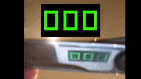

# recco
This is a mobile app that allows the user to record an audio/video while playing another audio/video in sync. Useful for musicians seeking to "play" together at distance.

The main problem this App solves is to playback and record a video at the same time with sub frame synchronism so that musicians can use it to record the various tracks of a music, for example.

## Development Tips

### Development machine preparation

* Install XCode and/or Android Studio

* Install React Native related tools
```
brew install node
brew install watchman
sudo gem install cocoapods
npm install -g react-native ios-deploy
```

* After cloning project from repo
```
cd Recco
npm install

cd ios
pod install
```

* Launch app on emulator 
```
npx react-native run-ios
```

### Common tasks

* Run app on real device

  * Open project on XCode
```
open ios/Recco.xcodeproj
```

  * Configure certificate on XCode

    * Open project on XCode, then click on "Recco" on root folder -> Target "Recco" -> Tab  "Signing & Capabilities" and select a certificate in "Team" dropbox

  * Run app on real device
```
npx react-native run-ios --device "Flavios iPhone"
```

  * Add the certificate used on previous step as trusted in your device

    * On iPhone, go to Settings -> Device Management -> Developer App -> Your certificate and click "Trust"

    * Now locate App icon and launch it normally

    * It will start connected to your web server for hotdeployment and debuging

### Tips

* After adding a new react native lib, close any emulators or delete the App from the device, close web server and then run everything again. The bundle will be redownloaded from scratch.

### Tests

* This is an overlay of two videos showing sync between playback and record. The larger numbers is from a Internet video which shows a framecounter. This video was played on Recco while it recorded the video below, taken with a mirror on front of the camera (it is a scissor actually ;). The measurements of actual recording and playback lags of the real device were done automatically.

</img>

* In general, playback takes 200ms to actually start and record takes 800ms to begin after commanded. The app makes these measurements automatically because this varies from device to device.


